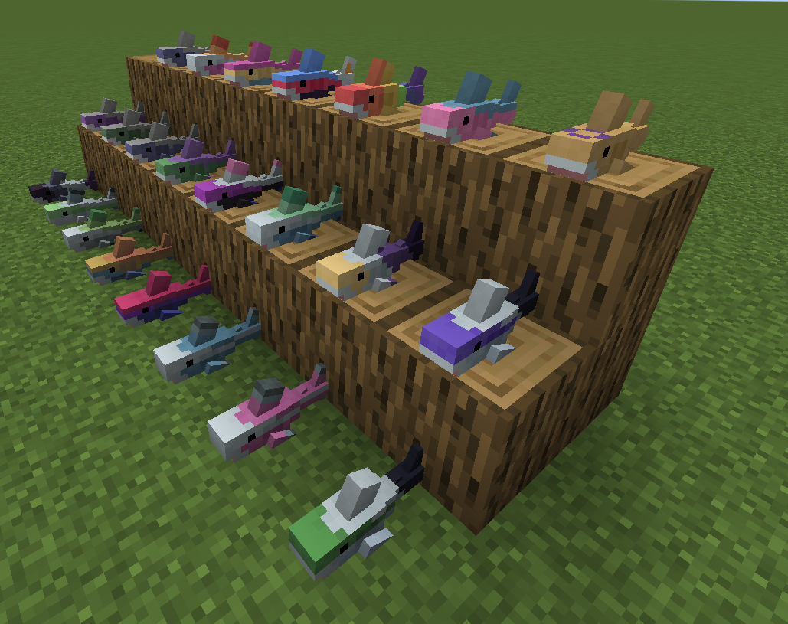
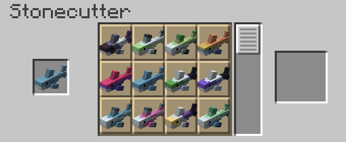

# Blåhaj

**A minecraft mod that adds the IKEA BLÅHAJ Soft toy shark and a giant bread pillow as items.**

- When you craft or rename a plushie, it'll have your username attached to it.
- You can place the plushies down!
- This mod is required on both server and client.

## Content

| Item                | Preview                                                         | Recipe                                                                     |
|---------------------|-----------------------------------------------------------------|----------------------------------------------------------------------------|
| Soft Toy Shark      |  |       |
| Gray Toy Shark      |  |   |
| Soft Toy Blue Whale |  |    |
| Bread Pillow        |       |      |
| Brown Bear          |  | Gift from Fletchers, Butchers and Leatherworkers when you rescue a village |
| Pride Sharks        |        |      |

## Original Quilt Version

This is a port of the original [Hibiii/Blahaj: BLÅHAJ Soft toy, shark mod, 16px](https://github.com/Hibiii/Blahaj).
If you are a Quilt user on <=1.20.1 use their version instead and say thanks! 😄

## License

- This mod - as its original - is licensed under the Unlicense. Feel free to learn from it and incorporate it in your
  own projects.
- The icon of this project is the Blobhaj by Heatherhorns, and is licensed under a Creative Commons Attribution 4.0
  International License.
- Most ingame images are from the original creator Hibiii.
